  

  

  

## 🚀 About Me

- 👨‍💻 Full Stack & Systems Engineer building real-world platforms end to end — from C++ solver cores to Next.js dashboards.
- 🌊 Currently building for **Smart India Hackathon 2026**: urban flood nowcasting, GPU-accelerated optimization and air-gapped agentic AI.
- 🤖 Working on agentic & multimodal AI — multi-agent systems, RAG over private documents, LLM-powered decision support (Gemini, local open-weight models).
- 🧠 Strong interest in backend architecture, simulation, digital twins and numerical computing.
- 📊 Sharpening Data Structures & Algorithms on LeetCode and HackerRank.
- 📫 Reach me at: **arpitpandey0307@gmail.com**

## 🏆 Featured — Smart India Hackathon 2026

- [🌊 Drishti — Street-level Urban Flood Nowcasting](https://github.com/arpitpandey0307/Drishti) · *SIH26085*
  - Closed-loop flood intelligence: rainfall nowcasting, 1D–2D hydraulic simulation, digital-twin state assimilation and probabilistic forecasts — *know where the water will stand, three hours before it does.*
  - Python · NumPy/SciPy physics · PyTorch → ONNX surrogate · MapLibre GL + Three.js dashboard
  - 🔗 **Live:** [Dashboard](https://drishti-indol.vercel.app/dashboard/) · [3D storm replay](https://drishti-indol.vercel.app/) · [Explainer video](https://youtu.be/MfLX_qhArzU)

- [⚙️ SOV-OPT — Sovereign GPU-Accelerated Optimization Engine](https://github.com/arpitpandey0307/SOV-OPT) · *SIH26119 (MRPL)*
  - LP / MILP / QP solver written from scratch in C++20 with CUDA — no existing solver library — with trustworthy presolve, numerical self-healing, safe reoptimization and an independent solution verifier benchmarked against HiGHS.
  - C++20 · CUDA · pybind11 · FastAPI · Next.js · Docker

- [🛡️ Sovereign On-Premise Agentic AI Workbench](https://github.com/arpitpandey0307/Sovereign-On-Premise-Agentic-AI-Workbench) · *SIH26117 (MRPL)*
  - Air-gapped-by-design AI workbench: upload confidential reports, P&IDs and spreadsheets, then run multi-step agents with code execution on locally hosted open-weight models — zero external network calls, full audit trail.
  - FastAPI · SQLAlchemy · Neo4j knowledge graph · OCR + RAG · sandboxed execution · React · Playwright

## 🤖 AI & Intelligent Systems

| Project | What it does | Stack |
|---|---|---|
| [🏟️ FIFA Nexus AI](https://github.com/arpitpandey0307/fifa) · [Live](https://fifa-three-nu.vercel.app) | Smart-stadium ops platform — crowd, security, incidents, transport & multilingual fan assistant | Next.js 16, Gemini, Cloud Run |
| [🏙️ CityTwin AI](https://github.com/arpitpandey0307/digital-twin) | Multi-agent "AI Chief Officer" with an 8-stage cascading city digital-twin simulator | FastAPI, React, Docker |
| [🔍 BiasLens](https://github.com/arpitpandey0307/bias-lens) · [Live](https://biaslens-ui.onrender.com/) | Plug-and-play fairness auditor — 4 fairness metrics, AI explanations, PDF reports | FastAPI, React, Gemini |
| [🗳️ ElectIQ](https://github.com/arpitpandey0307/electiq) | Gamified election education with streaming AI chat, timeline, quizzes & scenario simulator | FastAPI, Gemini 2.5, Cloud Run |
| [🧠 SmartDesk](https://github.com/arpitpandey0307/smart-desk) | Multi-agent AI Chief of Staff (Gen AI Academy APAC 2026) | Google ADK, Gemini, Vertex AI |
| [🏟️ StadiumOS](https://github.com/arpitpandey0307/Stadium-OS) | 4-agent coordination engine simulating live stadium operations | Node.js, Next.js, Firebase, Leaflet |
| [💹 Venture Alpha](https://github.com/arpitpandey0307/venture-capital) | Autonomous VC scouting agent — trend detection, due diligence & investment memos | Python, Gemini, Exa, MongoDB |
| [🌿 EcoGuide AI](https://github.com/arpitpandey0307/carbon-foot) | Carbon-footprint assistant with ranked, personalised reduction plans | React, rule engine |
| [👁️ Multimodal Intelligence System](https://github.com/arpitpandey0307/multimodal-intelligence-system) | Text + vision fusion for VQA, captioning and automation pipelines | Python, Jupyter |
| [🧬 eDNA Biodiversity](https://github.com/arpitpandey0307/-Identifying--Taxonomy-and-Assessing-Biodiversity-from-eDNA--Datasets) | Taxonomy identification & biodiversity assessment from environmental DNA | TypeScript, ML |

## 🌐 Full Stack & Web

| Project | What it does | Stack |
|---|---|---|
| [⚡ DPOS](https://github.com/arpitpandey0307/dpos) · [Live](https://dpos-red.vercel.app/) | Daily Performance OS — time blocks, gym logs, notes & auto-calculated daily score | Next.js 16, Prisma, PostgreSQL |
| [🎬 Movie Ticket Booking](https://github.com/arpitpandey0307/movie-ticket-booking) | BookMyShow-style platform with multi-role auth & Redis caching | Next.js, Express, MongoDB, Redis |
| [⬇️ Kinetic_DL](https://github.com/arpitpandey0307/Kinetic_DL) · [Live](https://kinetic-downloader.onrender.com) | Cyberpunk multi-platform video downloader & in-app streamer | TypeScript, Express, yt-dlp |
| [🚀 ARES VII](https://github.com/arpitpandey0307/ares-vii) · [Live](https://ares-vii.vercel.app) | Scroll-driven 3D storytelling journey from Earth to Mars | Three.js, GSAP |
| [❤️ Heart Disease Analysis](https://github.com/arpitpandey0307/Heart-disease-analysis) · [Live](https://heart-disease-analysis.vercel.app) | Interactive dashboards revealing cardiovascular risk patterns | Tableau, Flask, MySQL |
| [📈 Netflix Stock Prediction](https://github.com/arpitpandey0307/netflix-stock-prediction) | End-to-end ML pipeline dashboard — EDA to 5 regression models | Python, Streamlit, scikit-learn |
| [🎮 Gamefied Therapy](https://github.com/arpitpandey0307/gamefied-therapy) | Camera-based gamified physiotherapy with real-time pose tracking | TensorFlow.js MoveNet, p5.js |
| [🏘️ Community Hub](https://github.com/arpitpandey0307/community-hub) | Society notice board — announcements, events, marketplace | HTML, CSS, JavaScript |

## 🛠️ Skills & Technologies

<h3 align="center">🧑‍💻 Languages</h3>

<h3 align="center">🤖 AI / ML</h3>

<h3 align="center">⚙️ Backend</h3>

<h3 align="center">🎨 Frontend & 3D</h3>

<h3 align="center">🗄️ Databases</h3>

<h3 align="center">☁️ Cloud, DevOps & Tools</h3>

<h3 align="center">📚 Currently Learning</h3>

## 📈 Activity

  <picture>
    <source media="(prefers-color-scheme: dark)" srcset="./assets/activity-graph-dark.svg">
    
  </picture>
   
  Generated daily by a GitHub Action from my contribution calendar.

 

  

<h2 align="center">🌐 Connect With Me</h2>

  &nbsp;
  &nbsp;
  &nbsp;
  &nbsp;
  &nbsp;
  

  

