  

  

  

## 🚀 About Me

  
  

## 🛠️ Skills & Technologies

<h3 align="center">🧑‍💻 Languages</h3>

<h3 align="center">🤖 AI / ML</h3>

<h3 align="center">⚙️ Backend</h3>

<h3 align="center">🎨 Frontend & 3D</h3>

<h3 align="center">🗄️ Databases</h3>

<h3 align="center">☁️ Cloud, DevOps & Tools</h3>

<h3 align="center">✨ Daily Drivers</h3>

  
  
  
  
  

## 📈 Activity

  <picture>
    <source media="(prefers-color-scheme: dark)" srcset="./assets/activity-graph-dark.svg">
    
  </picture>
   
  Every stat on this page is regenerated automatically by GitHub Actions.

 

  <picture>
    <source media="(prefers-color-scheme: dark)" srcset="./assets/stats-dark.svg">
    
  </picture>
  <picture>
    <source media="(prefers-color-scheme: dark)" srcset="./assets/languages-dark.svg">
    
  </picture>

  <picture>
    <source media="(prefers-color-scheme: dark)" srcset="./assets/streak-dark.svg">
    
  </picture>

 

  <picture>
    <source media="(prefers-color-scheme: dark)" srcset="https://raw.githubusercontent.com/arpitpandey0307/arpitpandey0307/output/snake-dark.svg">
    
  </picture>

<h2 align="center">🌐 Connect With Me</h2>

  &nbsp;
  &nbsp;
  &nbsp;
  &nbsp;
  &nbsp;
  &nbsp;
  &nbsp;
  

  

